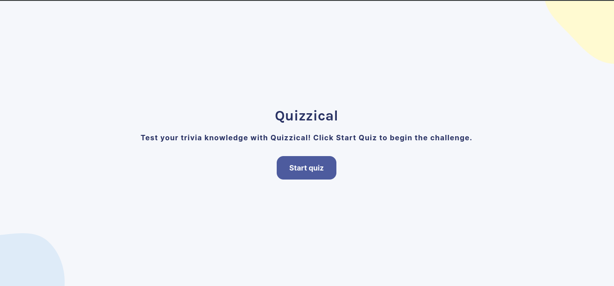

# 🎮 Quiz App

## 📖 Introduction
Welcome to the Quiz App! This application allows users to test their knowledge with multiple-choice questions. It fetches trivia questions from an API and provides immediate feedback on answers, including the option to play again with a new set of questions.

## Screenshot

[View Live site](https://quizzical-b24.netlify.app/)

## 🚀 How to Use
1. **Start the Quiz:** Click the "Start Quiz" button on the landing page to fetch a set of trivia questions.
2. **Answer Questions:** Click on any of the multiple-choices to select your answer.
3. **Check Answers:** Click the "Check answers" button to see which answers are correct and receive your score.
4. **Play Again:** After checking your answers, click the "Play again" button to start a new quiz with a fresh set of questions.

## 🔨 How I Built It
1. **Frontend:** Developed using React for the user interface.
2. **State Management:** Used React hooks (`useState`, `useEffect`) to manage application state and handle side effects.
3. **API Integration:** Fetched trivia questions from the Open Trivia Database API.
4. **Styling:** Applied CSS for layout and styling, including responsive design adjustments.

## ⭐ Key Features
- Fetches trivia questions from an external API.
- Shuffle answers to provide a different experience each time.
- Tracks user selections and calculates the score.
- Provides feedback on correct and incorrect answers.
- Allows users to start a new quiz with a "Play again" feature.

## 🛠️ Challenges
- **API Integration:** Handling the asynchronous API call and managing the state based on fetched data.
- **State Management:** Ensuring that state is reset correctly when starting a new quiz.
- **Responsive Design:** Making sure the application is usable on both desktop and mobile devices.

## 📚 What I Learned
- **React Hooks:** Gained hands-on experience with `useState` and `useEffect` for managing state and side effects in React.
- **API Handling:** Improved skills in handling API responses and updating the UI based on asynchronous data.
- **Conditional Rendering:** Learned to conditionally render components and manage user interactions effectively.

## 💪 What I Am Proud Of
- Successfully implemented a dynamic quiz application with real-time feedback.
- Designed a user-friendly interface that is both functional and visually appealing.
- Developed a reusable component architecture for handling trivia questions.

## 🏁 Conclusion
The Quiz App is a robust and engaging tool for testing trivia knowledge. It demonstrates the ability to integrate external APIs, manage state effectively, and create a responsive user interface. This project has been a valuable learning experience and showcases the practical application of React in building interactive web applications.

---

Feel free to explore and enjoy testing your trivia knowledge with this application!
